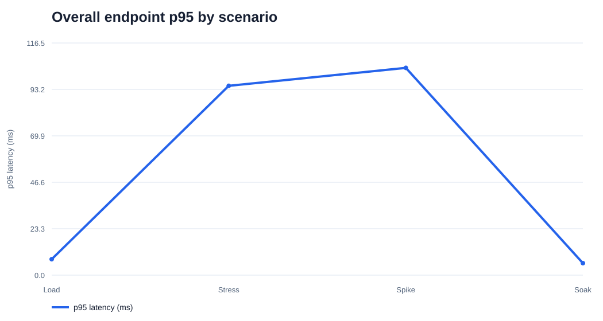
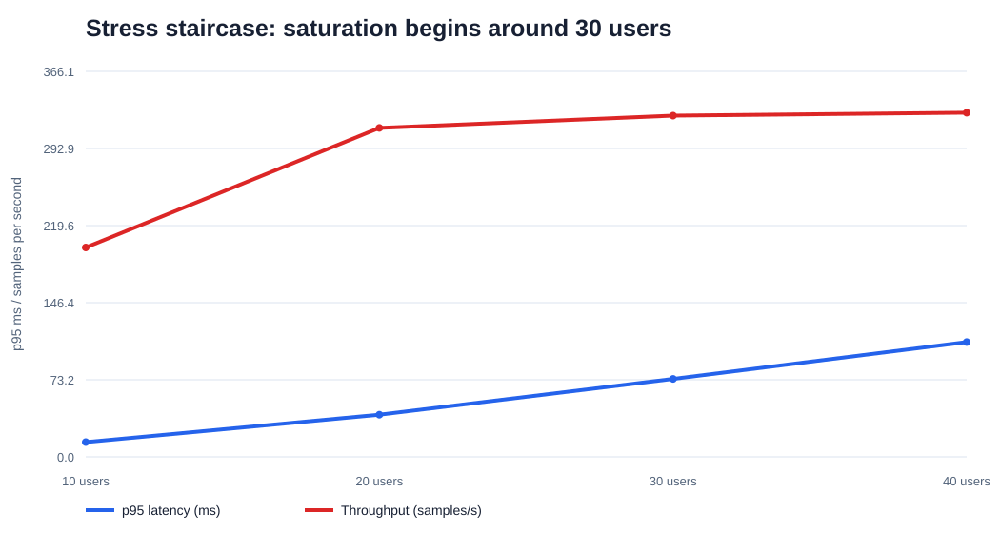
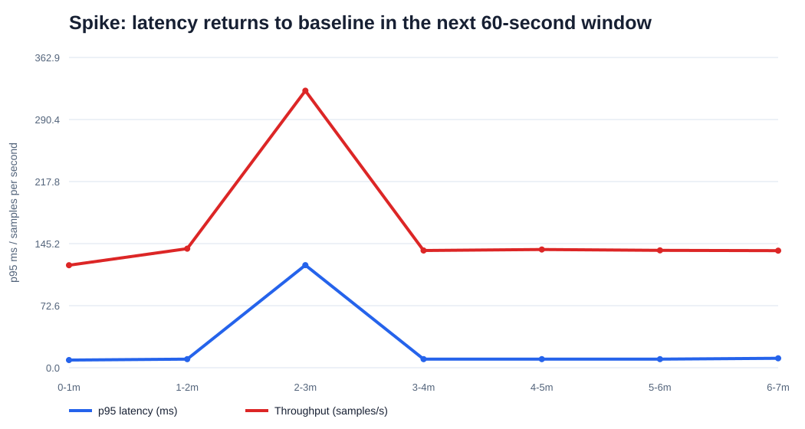
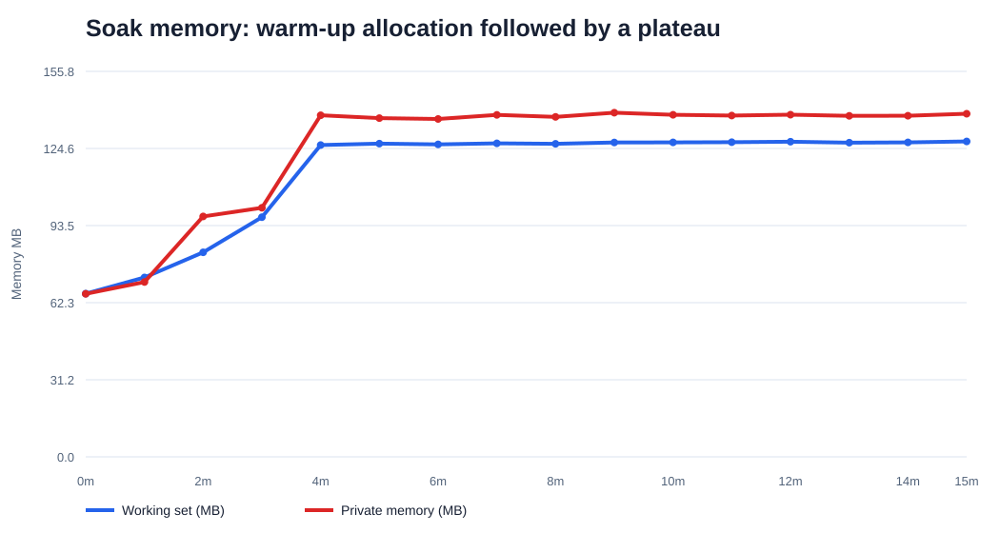
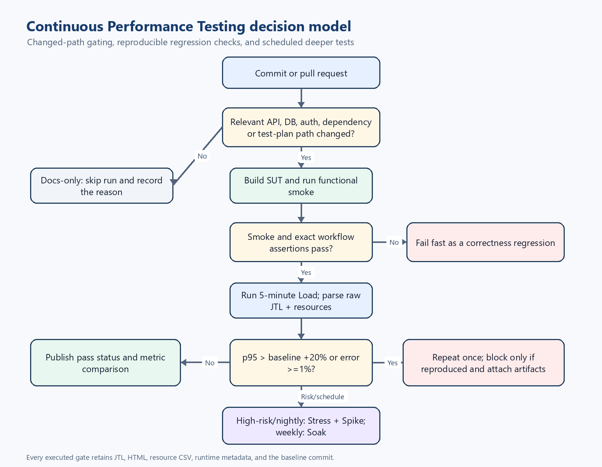

# HW05 — AI-assisted Performance Testing Report

| Field | Value |
| --- | --- |
| Student | **Nguyễn Đình Thái Hưng** |
| Student ID | **23127373** |
| Test date | 2026-08-14 (Asia/Ho_Chi_Minh) |
| SUT | EShop Node.js/Express/SQLite backend, localhost:3000 |
| Tool | Apache JMeter 5.6.3 non-GUI |
| Repository | <https://github.com/z3nz3nn/HW05-software-testing> |
| Demo | **[VIDEO_URL — HUMAN REVIEW REQUIRED]** |

## 1. Requirement summary and scope

The assignment requires one non-duplicated end-to-end workflow covering auth-heavy, read-heavy and transactional endpoint groups. Load, Stress and Spike must all execute that same workflow using CSV data, three different JMeter report/listener types, raw JTL and HTML reports. Real executions need resource/hardware evidence, a 10–15 minute soak threshold and a six-minute-or-longer Vietnamese video. Gemini must analyze raw JTL, while the student corrects metric misinterpretations and classifies optimizations. The conclusion needs a continuous performance-testing flowchart with cost/false-alarm trade-offs. AI Audit, a 200–300 word critique, logical Git commits and a README self-assessment are mandatory; any missing document can result in zero.

Two group members had already selected product list/search, product detail, login, forgot-password, cart/checkout and coupon endpoints. I therefore selected the following account-lifecycle workflow:

```text
POST /api/register
  → extract new id
  → GET /api/admin/users and verify the same id + email
  → DELETE /api/admin/users/{id}
```

Mapping: registration is auth-heavy; the admin users list is read-heavy; deletion is a state-changing transactional cleanup. This workflow is present unchanged in all three required plans. The exact group message is in `docs/group-selection-message.md`.

> **Student confirmation (2026-08-18):** The account-lifecycle workflow is unique within the group. Private group-chat content is not committed to the public repository.

## 2. SUT and source review

The official [EShop repository](https://github.com/ttbhanh/eshop-sut), [API specification](https://github.com/ttbhanh/eshop-sut/blob/main/api_specification.md) and [backend server source](https://github.com/ttbhanh/eshop-sut/blob/main/backend/server.js) were inspected before implementation.

Source-backed facts:

- `database.js` opens one `sqlite3.Database` connection and drops/recreates/seeds tables on every backend start. WAL and `busy_timeout` are not configured.
- `/api/register` returns HTTP 200 with `{message,id}`. Contrary to FR-01, neither the table nor handler enforces unique email.
- `/api/admin/users` and DELETE `/api/admin/users/:id` authenticate a JWT but do not check an admin role; this is an FR-12/SEC-03 mismatch outside the selected performance workflow's main claim.
- The JWT has no expiry in this version. The wrapper logs in once before measurement and passes the JWT as a JMeter property; `/api/login` is excluded because another group member selected it.
- Each controlled run starts and stops its own backend, so the source-defined startup reset isolates scenarios.

The official [JMeter download](https://jmeter.apache.org/download_jmeter.cgi), [Test Plan manual](https://jmeter.apache.org/usermanual/test_plan.html) and [component reference](https://jmeter.apache.org/usermanual/component_reference.html) were used. The portable JMeter 5.6.3 archive SHA-512 was verified as:

```text
387fadca903ee0aa30e3f2115fdfedb3898b102e6b9fe7cc3942703094bd2e65b235df2b0c6d0d3248e74c9a7950a36e42625fd74425368342c12e40b0163076
```

## 3. Hardware and execution environment

| Item | Measured value |
| --- | --- |
| Hostname | ASUS |
| Model | ASUSTeK ROG Zephyrus G14 GA401QM |
| OS | Windows 11 Pro 10.0.26200 |
| CPU | AMD Ryzen 7 5800HS, 8 physical / 16 logical processors |
| RAM | 23.41 GB |
| GPU | AMD Radeon Graphics |
| Java | Temurin OpenJDK 17.0.19 |
| Node.js | v24.16.0 |
| JMeter | 5.6.3 |

Machine-readable evidence is in `evidence/hardware/hardware-report.json`; `dxdiag.txt` and the browser-rendered evidence screenshot are also committed.

> **HUMAN REVIEW REQUIRED:** Add four real GUI captures under `evidence/screenshots/manual/`: `01-dxdiag-system.png` showing dxdiag System information and hostname `ASUS`; then `02-load-jmeter-task-manager.png`, `03-stress-jmeter-task-manager.png` and `04-spike-jmeter-task-manager.png`, each showing the active JMeter non-GUI run together with Task Manager's backend `node.exe` CPU and Memory in the same frame. The exact safe rerun commands and acceptance checks are in `docs/manual-completion-checklist.md`.

## 4. AI-first design and human correction

Gemini Pro was prompted first for workloads, test tree, assertions, data isolation and hypotheses. The first output was treated as a proposal. A corrective prompt then supplied source counter-evidence. Timestamps, prompts, structured outputs and screenshots are in `AI-Audit-Report.md`.

Material corrections:

1. Gemini predicted `SQLITE_BUSY` and one-core saturation without measurement. Final design treats failure mode as an empirical question and records latency, throughput, CPU and memory.
2. The prompt incorrectly said duplicate emails fail. Source inspection and a controlled reproduction showed two HTTP 200 responses with IDs 3 and 4.
3. The suggested 50,000-row CSV was replaced by one CSV seed row plus a per-iteration UUID.
4. Replacing an open SQLite file was rejected. Each wrapper-controlled backend restart produces a clean seed database.
5. Dashboard graph names were not three listener types. Final plans use Summary Report, Aggregate Report and View Results Tree.
6. Gemini's independent substring checks were replaced with a `JsonSlurper` assertion requiring the extracted ID and generated email on the same JSON object.
7. Proposed p95/error values are labeled starting SLO hypotheses, not measured facts.

The full human review is in `docs/human-review-design.md`. The mandatory 279-word critique is in `AI-Critique.md`.

## 5. Final JMeter design

### 5.1 Shared data-driven workflow

Each Thread Group contains:

1. CSV Data Set Config reads `name,password,domain` from `data/users.csv` and recycles seed values.
2. Cached Groovy JSR223 PreProcessor clears stale `registered_id` and creates `${scenario}-${UUID}@${domain}`.
3. `POST /api/register` sends the exact generated email; JSON Extractor stores `$.id`.
4. JSR223 assertion requires HTTP 200 and a positive numeric ID.
5. If an ID exists, `GET /api/admin/users` runs with the injected admin JWT. Its assertion parses the JSON array and requires one object whose numeric `id` and `email` both equal the correlated values.
6. `DELETE /api/admin/users/${registered_id}` runs after GET even when the GET assertion fails because Thread Group action-on-error is Continue. Its assertion requires HTTP 200 and the expected acknowledgement.
7. A Flow Control Action and Uniform Random Timer add one per-iteration pacing pause.

The Transaction Controller has `Generate parent sample` disabled so raw endpoint metrics are not double-counted. The CLI wrapper rejects occupied port 3000, verifies backend readiness and JWT, checks resource CSV within five seconds, refuses overwrites and validates the resource-row count after execution.

### 5.2 Scenario profiles

| Plan | Profile | Pacing | Distinct listener |
| --- | --- | --- | --- |
| `23127373_Load_20260814.jmx` | 15 users, ramp 30s, duration 300s | 200–500 ms | Summary Report |
| `23127373_Stress_20260814.jmx` | Four overlapping groups create 10/20/30/40 users, each 120s | 50–200 ms | Aggregate Report |
| `23127373_Spike_20260814.jmx` | 10-user baseline for 420s; +40 users at 120–180s | 100–300 ms | View Results Tree |
| `23127373_Soak_20260814.jmx` | 10 users, ramp 60s, duration 900s | 300–1000 ms | Aggregate Report supporting view |

Starting hypotheses: Load/Soak p95 <500 ms and errors <1%; Stress/Spike p95 <2000 ms. Capacity knee is where extra users give little/no throughput gain while p95 rises. Spike recovery is the first post-spike 60-second window returning within 20% of baseline p95. Soak stability additionally needs a five-minute trailing RSS slope below 1 MB/min.

### 5.3 Validation before full execution

A one-user Load smoke ran eight seconds and produced 546 endpoint samples: 182 POST, 182 GET, 182 DELETE, 0 errors. The Skill analyzer reproduced p95 9 ms. An initial PowerShell property-passing error produced zero samples and was fixed by accepting semicolon-separated `key=value` overrides. No failed smoke values were reported as SUT results.

## 6. Execution integrity and one excluded run

All main scenarios ran sequentially. The first five-minute Load JTL had 18,989 successful samples, but the resource child process received unquoted paths containing spaces and wrote no CSV. The run was explicitly invalidated, moved under `evidence/invalid-runs`, and excluded from every conclusion. The wrapper was changed to quote paths, capture monitor stdout/stderr, require a first row within five seconds and require at least two rows after completion. A six-second Stress smoke produced 1,274 samples, 0 errors and 10 resource rows, proving the fix before the Load rerun.

The accepted execution order and timestamps were:

| Scenario | Start ICT | End ICT | Resource rows |
| --- | --- | --- | ---: |
| Load | 01:02:52 | 01:07:52 | 301 |
| Stress | 01:08:53 | 01:16:53 | 480 |
| Spike | 01:17:52 | 01:24:53 | 420 |
| Soak | 01:25:29 | 01:40:30 | 895 |

JTL percentiles use nearest-rank calculation. Transaction Controller parent rows are excluded. All metrics can be regenerated with `scripts/analyze_jtl.py`; resource metrics come from `scripts/analyze_resources.py`.

Chrome-captured supporting dashboards are preserved as `05-load-jmeter-dashboard.jpg`, `06-stress-jmeter-dashboard.jpg` and `07-spike-jmeter-dashboard.jpg` under `evidence/screenshots/`. They show the report source, execution time, 100% pass summary and available dashboard metrics. They do not replace the assignment's manual requirement to show JMeter and Task Manager in the same frame.

## 7. Results

### 7.1 Overview



| Scenario | Samples | Errors | Mean ms | p95 ms | p99 ms | Max ms | Samples/s |
| --- | ---: | ---: | ---: | ---: | ---: | ---: | ---: |
| Load | 19,311 | 0 | 5.317 | 8 | 15 | 777 | 64.5805 |
| Stress | 139,140 | 0 | 42.434 | 95 | 112 | 256 | 290.4826 |
| Spike | 67,818 | 0 | 27.255 | 104 | 124 | 283 | 161.8688 |
| Soak | 39,502 | 0 | 4.281 | 6 | 9 | 583 | 43.9395 |

All HTTP response codes were 200 and all JMeter assertions passed. The high maxima are isolated tail events; p95/p99 and window trends are therefore more representative than maximum alone.

### 7.2 Load

Load produced exactly 6,437 samples for each endpoint. Register p95 was 8 ms, GET p95 5 ms and DELETE p95 8 ms. Overall p95 8 ms and 0% error pass the starting localhost SLO. Resource CPU was normalized across 16 logical processors: mean 0.650%, p95 1.060%, max 1.342%. Node working set peaked at 127.133 MB.

Interpretation: 15 users are easily sustainable with this pacing and hardware. This test does not establish the maximum; it establishes a repeatable baseline.

### 7.3 Stress and capacity knee



| Active users | Window | Samples/s | p95 ms | Error % |
| ---: | --- | ---: | ---: | ---: |
| 10 | 0–120s | 198.86 | 14 | 0.00 |
| 20 | 120–240s | 312.35 | 40 | 0.00 |
| 30 | 240–360s | 324.06 | 74 | 0.00 |
| 40 | 360–480s | 326.86 | 109 | 0.00 |

From 30 to 40 users throughput rises only about **0.86%**, while p95 rises about **47.30%**. Therefore saturation onset/capacity knee is approximately **30 users**. This is not a crash or strict maximum: 40 users still completed with 0 errors. The correct conclusion is diminishing throughput return and increased queuing latency.

Node CPU p95 was 3.568% and working set max 130.055 MB, so whole-machine CPU exhaustion was not observed. Stress endpoint counts differ by at most 20 at the exact scheduler boundary because some threads were stopped between register/read/delete. Backend restart reset these bounded local orphans before the next run. This limitation is reported rather than hidden.

### 7.4 Spike and recovery



| Phase | Window | Samples/s | p95 ms | Error % |
| --- | --- | ---: | ---: | ---: |
| Pre-spike baseline | 60–120s | 139.22 | 10 | 0.00 |
| 50-user spike | 120–180s | 324.06 | 120 | 0.00 |
| First recovery window | 180–240s | 137.09 | 10 | 0.00 |

The first post-spike window returns to exactly the baseline p95 and within 1.53% of baseline throughput. Observed recovery is therefore **under 60 seconds**. Node CPU p95 was 3.076%; working set max was 129.871 MB. Endpoint count mismatch was 16 at scheduled termination and was isolated by backend restart.

### 7.5 Soak and endurance threshold



The 15-minute Soak produced 39,502 samples, 0 errors, overall p95 6 ms and 43.9395 samples/s. After the 60-second ramp, minute windows were stable around 45 samples/s and p95 mostly 6–8 ms. A few isolated maxima affected p99 in two windows but did not create errors or sustained p95 drift.

Working set rose from 65.945 MB during warm-up and plateaued near 127–128 MB. Over the final five minutes, the ordinary least-squares slope was **+0.030 MB/min** for working set and **−0.025 MB/min** for private memory; handle count ended at 230 versus 231 at start. This does not support a linear leak during the observed interval, but cannot prove absence over hours.

The empirically verified hardware endurance threshold is **10 concurrent users, about 43.94 endpoint samples/s, p95 6 ms, 0% errors, and an observed working-set ceiling of 128.10 MB for 15 minutes**. Calling this a maximum would overstate the evidence; the Stress run suggests higher concurrency remains possible but was not soaked for 15 minutes.

## 8. Genuine issue

The controlled reproduction sent the identical registration body twice. Both requests returned HTTP 200, with IDs 3 and 4. This violates FR-01 email uniqueness. The verified report was published as [GitHub Issue #1](https://github.com/z3nz3nn/HW05-software-testing/issues/1), with the committed reproduction screenshot embedded in the issue. On 2026-08-17 the repository was changed to **Public** after a tracked-file secret-pattern scan returned no matches; unauthenticated requests then returned HTTP 200 for both the repository and Issue. Local evidence is preserved in `evidence/issues/duplicate-email/`, `docs/issues/duplicate-email-registration.md`, `evidence/screenshots/08-github-issue-created.jpg`, and `evidence/screenshots/13-github-public-repository.jpg`.

## 9. AI log analysis and misinterpretation hunt

The four complete JTL files were uploaded to the existing Gemini Pro conversation. G-03 was asked to exclude parent rows, use nearest-rank percentiles and report aggregate plus window metrics. Gemini disclosed that its interface exposed only truncated strings, but still estimated from those fragments: it reported only ~380 Load and ~260 Stress endpoint samples instead of 19,311 and 139,140, used maxima 48/47 ms instead of 777/256 ms, and declared all requested Stress/Spike windows unavailable. Every quantitative G-03 result was rejected.

G-04 supplied the independently calculated `analysis/*.json` values. Gemini explicitly retracted G-03 and reproduced all aggregate/window values, including the 30→40-user throughput increase of 0.86%, p95 increase of 47.30%, and Spike recovery below 60 seconds. It then overreached again by claiming a particular internal component was “fully saturated” and that 15-minute telemetry proved no memory leak. G-05 retracted both claims. The accepted conclusion is limited to a measured capacity knee near 30 users and no material memory/handle growth signal during the observed 15 minutes; neither the internal causal component nor longer-term leak absence was proven. Exact timestamps, prompts, outputs, screenshots and human decisions are in `AI-Audit-Report.md`.

Optimization classifications already supported by source/reproduction:

| Recommendation | Classification | Reason |
| --- | --- | --- |
| Add normalized unique-email constraint and return 409 | Feasible functional fix; benchmark migration | Directly addresses reproduced FR-01 failure; needs migration/case tests |
| Add an index to `users.email` | Feasible only with a measured query/uniqueness use case | Helps lookup/constraint but current GET lists all users; not the measured capacity cause by itself |
| Enable SQLite WAL | Plausible experiment, not a proven fix | Current SUT has one connection; must benchmark write/read behavior and startup/reset semantics |
| Add a database connection pool | Hallucinated/poor fit as stated | Generic pooling advice does not automatically help a single-file SQLite workload and can increase writer contention |
| Replace SQLite with PostgreSQL | Architecturally feasible but out of homework scope | Large operational change; existing local results do not prove it is necessary |
| Cache `GET /api/admin/users` | Conditionally feasible but security-sensitive | Must invalidate on user mutations and enforce authorization; could expose stale/sensitive data |
| Raise JMeter threads until an HTTP crash appears | Rejected test advice | Capacity knee is already measurable; forcing a co-located laptop crash confounds generator and SUT |

G-03–G-05 did not produce new optimization recommendations; therefore the table remains a source- and measurement-backed feasibility classification instead of attributing invented recommendations to Gemini.

## 10. Continuous Performance Testing proposal



The complete flowchart, gates and trade-offs are in `docs/continuous-performance-testing.md`. In summary, a changed-path gate skips docs-only changes, runs functional smoke before performance work, runs five-minute Load for relevant pull requests, escalates DB/auth/high-risk changes to Stress/Spike, and runs Soak weekly. A regression is p95 more than 20% above the median of five comparable baselines or error ≥1%, then repeated once before blocking to reduce false alarms. Results always publish raw JTL, HTML and resource CSV.

Main trade-offs are runner cost, co-located noise, false alarms, false negatives between weekly Soaks, storage cost and baseline drift. Baseline changes require review and pinned hardware/runtime metadata.

## 11. Reusable Agent Skill

`skills/eshop-performance-testing` contains a validated `SKILL.md`, EShop API reference and raw-JTL summarizer. The official skill validator returned `Skill is valid!`; its analyzer reproduced the real Load smoke values. The Skill enforces source inspection, correlation/assertion review, non-GUI execution, resource evidence and deterministic metrics before AI interpretation.

> **HUMAN REVIEW REQUIRED:** The student must record the end-to-end Skill demo with their own Vietnamese narration and publish the YouTube link.

## 12. Limitations and conclusion

- JMeter, SUT and resource observation are co-located, so results characterize this laptop configuration and pacing, not production capacity.
- Only the Node process CPU/RAM was sampled; disk I/O and event-loop lag were not instrumented.
- Soak lasted 15 minutes, sufficient for the assignment but not for multi-hour leak detection.
- Scheduler termination can leave a small bounded partial workflow at the final boundary; backend restart isolates it between runs.
- Enabled result listeners satisfy the assignment but can add load-generator overhead. Raw JTL/HTML and sequential execution reduce ambiguity; a distributed production benchmark should disable heavy GUI listeners during generation and load JTL afterward.
- The starting p95 thresholds are hypotheses. Relative baselines on pinned CI hardware are more defensible than copying localhost milliseconds into production.

Within those limits, Load, Stress, Spike and Soak all completed with 0 assertion/HTTP errors. Load established a 15-user baseline; Stress found diminishing return around 30 users; Spike recovered within the next 60-second window; and Soak verified 10 users for 15 minutes at p95 6 ms, 43.94 samples/s and a stable five-minute memory slope. The strongest lesson from the AI-first process is that confident AI output becomes useful only after source inspection, real execution and independent metric recalculation.

## 13. AI Critique (279 words)

Gemini helped turn the assignment constraints into an initial workload model, but its first answer mixed source facts, generic testing patterns, and unsupported predictions. It claimed `SQLITE_BUSY` would be the primary bottleneck and that Node.js would saturate one core first. The source actually opens one shared `sqlite3` connection, so request queuing was at least as plausible. The measured Stress run produced no lock errors; instead, throughput changed only from 324.06 to 326.86 samples/s between 30 and 40 users while p95 rose from 74 to 109 ms. Gemini also inherited my incorrect statement that duplicate emails fail. Source review and two real requests proved the opposite: both returned HTTP 200 with different IDs. Its proposal for 50,000 CSV rows and replacement of an open database file was unnecessary and unsafe. A UUID email and controlled backend restart were more defensible.

The raw-JTL interaction exposed a second failure mode. Although four complete files were attached, Gemini saw truncated strings and estimated about 380 Load and 260 Stress samples instead of 19,311 and 139,140. A corrective prompt supplied deterministic nearest-rank results, which Gemini reproduced, but it then attributed the capacity knee to a “fully saturated” internal component and claimed that 15-minute telemetry proved no memory leak. A final challenge made it retract both claims and limit the conclusion to the observation window. The revised design also replaced substring checks with parsed JSON matching the ID and email on the same object. These errors show why fluent caveats are not enough: provenance, arithmetic, and causal claims require separate checks. My reliable pattern became propose, inspect source, execute, recalculate from raw rows, challenge with exact counter-evidence, and accept only conclusions bounded by the measurement.

## Appendix index

- AI Audit: `AI-Audit-Report.md`
- AI Critique: `AI-Critique.md`
- Requirements traceability: `docs/requirements-traceability.md`
- Human design review: `docs/human-review-design.md`
- Continuous model: `docs/continuous-performance-testing.md`
- Video script: `docs/video-script-vi.md`
- Manual checklist: `docs/manual-completion-checklist.md`
- Git log: `git-commit-log.txt` (export after final commit)
