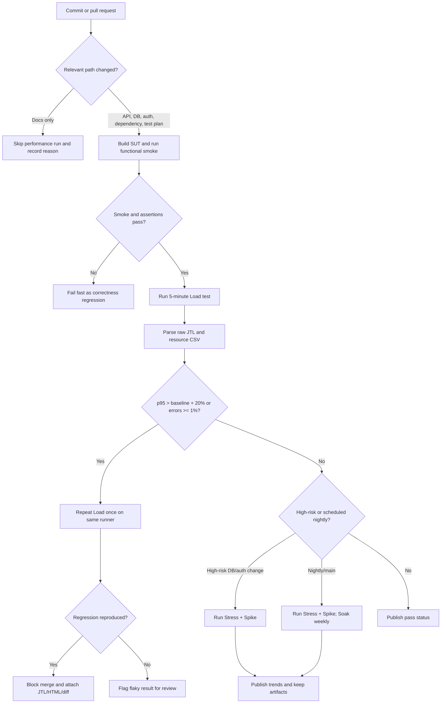

# Continuous Performance Testing proposal

## Decision model

The pipeline watches commits but does not run the full 35-minute local suite on every change. A changed-path gate selects the cheapest useful test, then compares the new p95/error/throughput values with a versioned baseline produced on equivalent hardware.

## Versioned gates

| Gate | Starting rule | Reason |
| --- | --- | --- |
| Correctness | Every sampler assertion passes | An HTTP 200 with the wrong ID/email is still a failed workflow |
| Load | error <1%; p95 ≤500 ms; no >20% p95 regression from median of last five comparable passes | Combines an absolute hypothesis with a relative regression gate |
| Stress | No error increase and throughput gain does not flatten before the accepted capacity knee | This run measured saturation onset around 30 users without HTTP failures |
| Spike | p95 returns within 20% of pre-spike baseline in the first post-spike 60-second window | This run recovered from p95 120 ms to 10 ms within one window |
| Soak | error <1%; p95 ≤500 ms; five-minute trailing RSS slope <1 MB/min | Detects sustained drift while tolerating Node.js warm-up allocation |

The committed measurements are a localhost reference, not a universal production SLA. A CI runner must first establish its own baseline using at least five clean runs on pinned CPU/RAM/OS/JDK/Node versions.

## Trade-offs

- **Cost and duration:** Load on relevant pull requests, Stress/Spike only for high-risk changes or nightly, and Soak weekly keeps developer feedback fast while retaining endurance coverage.
- **False alarms:** Shared runners and co-located load generation create noise. Pin runner size, serialize performance jobs, record CPU/RAM, compare against a rolling median, and rerun one suspected regression before blocking.
- **False negatives:** A five-minute Load gate can miss leaks or rare lock contention. Weekly Soak and high-risk path triggers compensate, but do not replace production observability.
- **Baseline drift:** Automatically accepting every green result could slowly normalize regressions. Baseline updates require review, a reason, and a linked performance artifact.
- **Data retention:** Raw JTL/HTML consume storage. Keep pull-request artifacts 30 days, release/main artifacts 180 days, and weekly baselines for the semester.
- **Security and isolation:** Use localhost/ephemeral databases and short-lived test credentials. Never point destructive cleanup at a shared or production database.

## Pull-request output

The pipeline posts a compact comparison table—samples, error %, p50/p95/p99, throughput, CPU p95, memory slope—and links the raw JTL, HTML report and the commit that produced the baseline. A failed gate must identify the exact label and time window rather than say only “performance is bad.”
